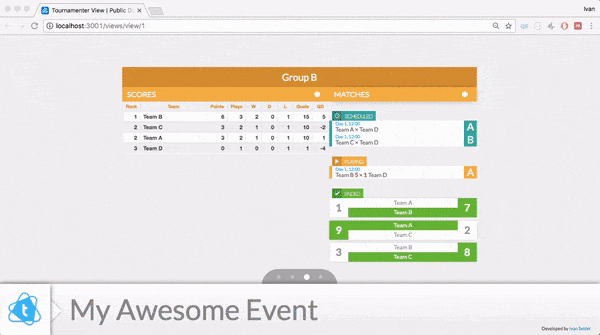
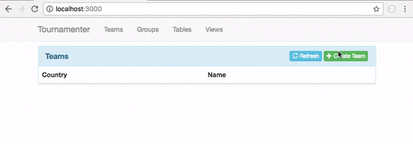
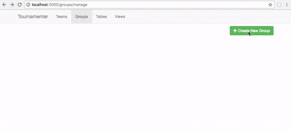
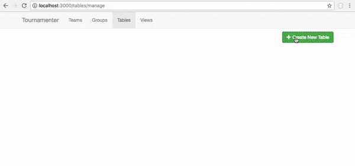

[![NPM Version][npm-version-image]][npm-version-url]

> Manage Tournament events - Scores, Tables, Groups and Public Views.

[npm-version-image]: https://img.shields.io/npm/v/tournamenter.svg?style=flat
[npm-version-url]: https://www.npmjs.com/package/tournamenter

**Don't like to use Terminal? Use the Native Desktop Application for managing Server instances on Windows, Linux and Mac OSx:** [TournamenterApp](https://github.com/ivanseidel/TournamenterApp)

View a Demo hosted @ heroku: [Tournamenter DEMO](http://tournamenter-demo.herokuapp.com/)



## Installation
```bash
$ npm install -g tournamenter
```

## Execution
```bash
$ tournamenter
```

## Management
> Tournamenter is made for Organizers and the Public.

All the components of tournamenter allows to generate beautifull and configurable Live UI to 
show on TV's, Projectors and even Online. Management is restricted for Organizers.

But, we provide you with 'views': Customizable Presentations that renders real-time data for
the public. Just like "Power Point" presentations, but dynamic and alive.

## Management: Teams
> Manage Teams of your Event/People of your event. Create/Delete/Modify Team names and Country.



## Management: Groups
> Manage Groups Phases, Create matches and setup schedule.



## Management: Tables
> Manage Tables. Configure Scoring tables, customize ranking algorithm.



## Management: Views
> Manage Displays. Link multiple Groups, Tables, Messages and everything together for the public


### Server Configuration: Basics
> Configurations are assigned by Environmental Variables.

- `PORT`: (default: _3000_)
  Port the server will Bind to

- `APP_UID`: (default: _tournamenter_)
  An identification (lowercase and no spaces) for the application.
  It's like a "namespace", and is used for database creation and connection.

- `APP_NAME`: (default: _tournamenter_)
  Your application name. Usually, the name of the Event

- `APP_LOGO`: (default: _[internal_tournament_logo]_)
  Absolute Path to the Logo. Prefer `.png` files to ugly white backgrounds.

- `PASSWORD`: (default: _[none]_)
  Set's the password required to login. (There is no username)

### Server Configuration: Database
> Tournamenter uses Waterline ORM. It allows file db (default) and even MongoDB, MySql...

**Disk DB: Saves to a `.json` file**
- `DB_ADAPTER`: (default: `sails-disk`)
  `sails-disk` is already the default one. No need to change
- `DB_PATH`: (default: `./tmp/[APP_UID].db`)
  Change this to reflect where the db file will be stored.

It `DB_PATH` can be either:
- An Path to a **Folder**:
  Will use file `DB_PATH/[APP_UID].db` as db (ex: `~/`)
- An Path to a **File**:
  Will use file `DB_PATH` as db (ex: `~/mydb.db`)

**MongoDB: Connects to a MongoDB Server**
- `DB_ADAPTER`: (default: `sails-disk`)
  Set to `sails-mongo` in order to change to MongoDB
- `DB_URL`:
  An formated MongoDB URI ([Go Here for information](https://docs.mongodb.com/manual/reference/connection-string/))

### Server Configuration: Extensions
> Tournamenter allows dynamic loading setup of Extensions. It only requires a list of PATH's to load.

Dependencies are NodeJS Modules. They are given hooks to inject and modify Tournamenter Behavior.

To Run tournamenter with an Exension, provide:
- `TOURNAMENTER_EXTENSIONS`:
  With a list of absolute paths, separated by `:` or `,`. Ex: `~/myextensionA:~/myextB`

### Examples

> **Example 1**
> Running in PORT 4000, Setting LOGO and Changing name to `My Event`
```bash
PORT=4000 APP_LOGO=~/event.png APP_NAME="My Event" tournamenter
```

> **Example 2**
> Running in PORT 4000, Use custom database path
```bash
PORT=4000 DB_PATH=~/myfolder/event.db tournamenter
```

### Credits

Creator: [Ivan Seidel](https://github.com/ivanseidel)